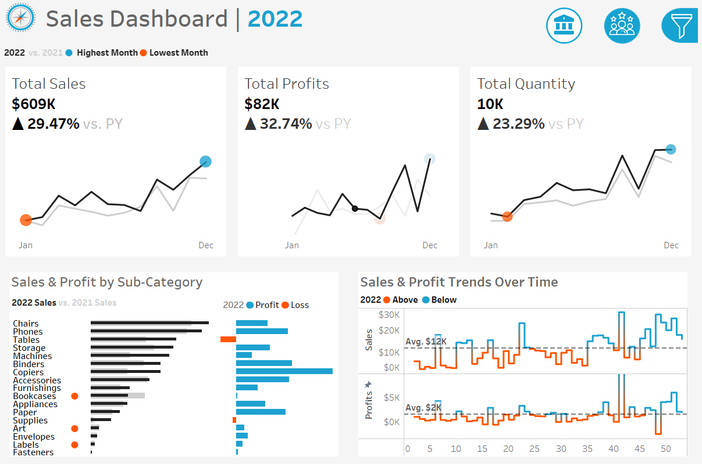
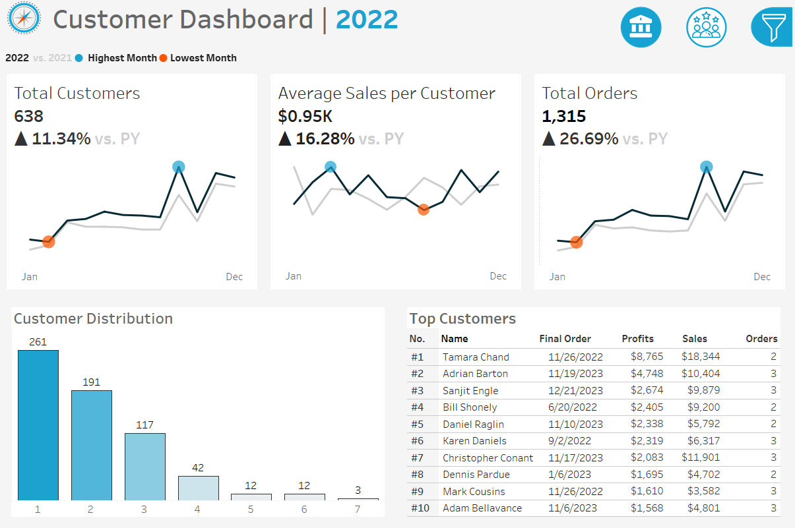
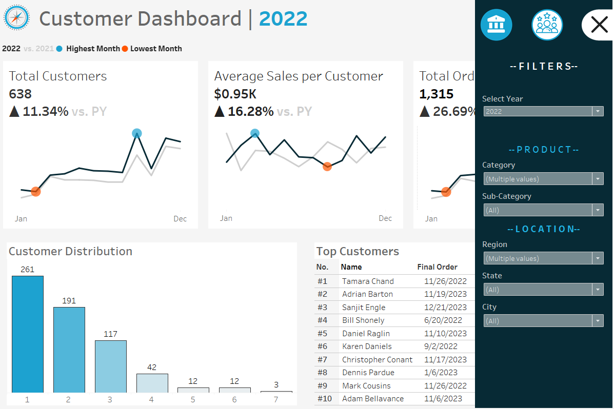

# Tableau_Dashboard
This project features a Tableau dashboard that analyzes and visualizes sales and customer trends. It provides insights into key performance metrics such as total sales, customer distribution, and trends over time, empowering data-driven decision-making for sales strategies and customer engagement. For a demo of the dashboard, click on the Tableau Public Link:
https://public.tableau.com/app/profile/alvan.dmello/viz/shared/XQFTK6R6G

## Dashboard Screenshots

*Screenshot 1: Sales Dashboard*

&nbsp;

*Screenshot 2: Customer Dashboard*

&nbsp;

*Screenshot 3: Filters in the Dashboard*
